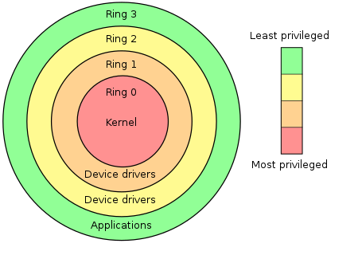
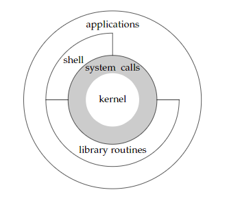

# UNIX System Overview

## 1.1 Intro
没啥奇怪的知识

## 1.2 UNIX Architecture
一些奇怪的知识：
- __OS__ regarded as __Software__
- __Kernel__ is small
- __Ring-0__ concept belong to 分级保护域 (英语：hierarchical protection domains)

- __Kernel__ in __Ring-0__
- __System Call__ between kernel and application/software


- __System Call(系统调用)__ regarded as __Interface__ of Kernel
- __Library Routines(公用函数库)__ base on System Call
- Application could call __"System Call" and "Library Routines"__
- 应用层软件可以调用系统调用与公用函数库
- __Shell__ is __special__ application as interface between application and system
- __OS__ including kernel & software in broad sense
__(software: system utility+app+shell+library routines)__

奇怪且刷新认知：
- GNU是操作系统（系列）
- Linux是GNU的kernel
- Linux的严格称呼GNU/Linux
- 不严格也是OK的
__(It  also  hasthe advantage of being moresuccinct.) I like it !__

## 1.3 Logging in
总觉得登录没啥奇怪的知识：

> We need what ?
> - login name
> - password

<span id = "jump2section1_3"> 

### 1.3.1 Logging Name
已存密码放在`/etc/passwd`中

> It's composedof  seven  colon-separated  fields:  
> - __the  login  name__ (登录名)
> - __encrypted  password__ (加密过的密码)
> - __numeric  user  ID(205)__ (用户ID)
> - __numeric group ID(105)__ (用户组ID)
> - __acomment field__ (注释字段 啥玩意啊？？？)
> - __home directory (/home/sar)__  (开始目录)
> - __shellprogram (/bin/ksh)__  (选定启用哪个shell)
> - ___sar\:x\:205:105:Stephen Rago:/home/sar:/bin/ksh___

### 1.3.2 Shell (其实我不喜欢他command-line-type)

只要用户登陆了，不管接下来显示什么系统信息等，之后一定会以shell提示结束并等待用户输入。
> Shell is what ???
> - A command-line interpreter
> - It could read user input
> - Execute command(shell script)->app/system call/library routines

我只认 __(ba)sh__，__(t)csh__ 花里胡哨特性增增减减，source环境和bash等经常冲突，javaVM也踩csh坑，别那么乱七八糟求你了md，你在干活不是在自己玩。蛇皮（

__各种shell历史轨迹（包袱）：__
> - 一代目shell从贝尔实验室出来，控制流结构 __Algol 68__
> - csh从伯克利出来，这崽种真的搞事情玩花样, 不过控制流结构为C-like
> - The C shell, developed by Bill Joy at Berkeley, is provided with all the BSD releases.Additionally,the  C  shell  was  provided  by  AT&T  with  System  V/386  Release  3.2  andwas  also  included  in  System  V  Release  4(SVR4). 
>> 所以这也是一方面我不用bsd的原因虽然现在也没有这方面的问题了
>> CSH: Its control flow looks morelike the C language 但好的feature还是得品的，短程作业控制我用过
> - The  Bourne-again  shell  is  the  GNU  shell  provided  with  all  Linux  systems.  It  wasdesigned  to  be  __POSIX__  conformant,  while  still  remaining  compatible  with  the  Bourneshell.  It supports features from __both the C shell and the Korn shell__.
>> 总之一句话：__POSIX 1003.2__ 规范化是真的好，bash天下第一
> - bash(Bourne-again shell) 规范化+考虑更多兼容性，support new feature of C/Korn Shell
> - tcsh(TENEX C Shell) csh的加强版

- 而且神奇的是很多BSD对选择替代品而不是随主流，比如选用Debian Almquist shell. Solaries混合了BSD & System V提供基本所有的shell及变体，或许这个更好折腾？？？

这样总体看下来历史包袱会很重...

## 1.4 Files and Directories
~~感觉没什么奇怪的知识吧？~~

### 1.4.1 File System
- 层级结构，起点为root(/)
- 目录项逻辑视图（树形图）与实际存放方式差距非常大，当多个文件具有多个硬链接时，很难保持多个属性副本之间的同步。
-在深浅拷贝有看到过，会有一个特定寻址操作，具体看后面chapter4.
- `stat` 和 `fstat` 函数会返回包含所有文件属性的信息
- 文件信息：the __type__ of file (regular file, directory), the __size__ of the file, the __owner__ of the file, __permissions__ for the file (whether other users may access this file), and __when the file was last modified__.

### 1.4.2 Filename
无非是一些naming rule 没意思不管他

奇怪的知识：
- 早期UNIX System V/Research Unix（老版UNIX）的文件系统限制文件名最长14个字符
- BSD扩充14个字符限制为255个
- 目前商业UNIX文件系统支持255个字符以上
- 哈？现在具体最多支持几个？爆掉为止咯

### 1.4.3 Pathname
绝对路径-clear

相对路径-clear

奇怪的知识：
> ls用C代码实现，惊惹，其实仔细想想也是这些application的确都应该而且历史上也的确用c写啊，被秀到了（虽然代码trivial...
---
```c
#include "apue.h"
#include <dirent.h>
int main(int argc, char *argv[])
{
    DIR *dp;
    struct dirent   *dirp;
    
    if (argc != 2)
        err_quit("usage: ls directory_name");
        
    if ((dp = opendir(argv[1])) == NULL)
        err_sys("can’t open %s", argv[1]);
    
    while ((dirp = readdir(dp)) != NULL)
        printf("%s\n", dirp->d_name);
    
    closedir(dp);
    exit(0);
}

```
---

不是，这还用分析？
如果上面的代码被存在myls.c可用gcc(GNU C)编译器编译，一般UNIX会把cc链接至gcc，所以gcc(1)=cc(1)，myls.c会被编译为a.out可执行文件，执行格式为：`./a.out /dev`

输出我不po了反正就那回事
- __ls(1) 表示法是UNIX原始习惯__
- __现在和以前一样也用man查看联机手册__
- > ___`apue.h`___ 头文件很关键(包含了标准系统头文件/常量/函数原型)
    >> This header includes some standard system headers and defines  numerous  constants  and function  prototypes.
- 系统头文件 ___`dirent.h`___ 用于给接下来的程序调用`opendir()`与`readdir()`函数原型与结构体`dirent`，但其它系统可能会把一份头文件内容分到多个文件中进行管理。
- The  declaration  of  the `main` function  uses  the  style  supported  by  the  __ISO  C standard__. 
- `opendir()` returns a pointer to a `DIR` structure. Call `readdir()` function returns a pointer to `dirent` structure or `NULL` if finished with the directory loop. Extract the name of each directory entry(`d_name`). Call `stat()` function to determine all the attributes of this file follow `file_name/d_name`.
- Exception or Error: ___`Permission denied / Not a directory`___.
- > Exit signal: 0 means OK (normal exit) but 1\~255 means that an error occurred. 0才是正常退出，1\~255都有不同异常的对应，见section 8.5, obtain the `exit` status of a program that it executes is crucial.
    >> 比如多线程/进程控制的时候就很尴尬因为你没有内部的wait/exit signal只有写异常终止指示文件，这就很蠢了，没错tsmc和AMD的憨憨就在这么搞。

### 1.4.4 Working Directory
每个进程都有工作目录（当前工作目录），所有进程认定的相对路径都从工作目录开始解释，Call `chdir()` to change workding directory.

### 1.4.5 Home Directory
当我们以用户身份登录机器的时候，我们的工作目录，没错，登录也是application，也是processing，也有工作目录，此刻工作目录被设定为起始目录(home directory)，系统如何得知何处为起始目录或者如何改变起始目录？
- Our home directory is obtained from our entry in the password file. [(Section 1.3)](#jump2section1_3)

## 1.5 Input and Output
很关键！

### 1.5.1 File Description
文件描述符(File Description)为非负整数

- 内核用于标识特定进程访问文件的记号，为内核服务
- 读写均会返回一个文件描述符

### 1.5.2 Std-In, Std-Out, Std-Err
All  shells  open  __three  descriptors__  whenever  a  new  program  is  run: __standard input__,  __standard output__,  and  __standard error__.

TODO

