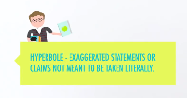
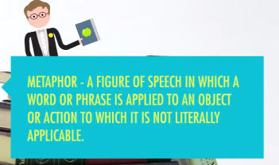

# Crash Course
## 1. English Literature
> before reading and writing...
---
### 1.1 How to read and why
> The ability of reading and writing is so-called __"Markers of Civilization(文明之记号)"__, and they could help us communicate directly and transparently with people who live very far away from us and even we could hear the voice of the dead.

    Story is about communication.
    故事即交流的一种方式!
此处强调了阅读和写作的用途，着重了在交流和增长阅历方面的益处。  

We invented grammar to help us __describe__ everything including preposition, if not, we must using hands gesture.

> __And reading is an act of empathy !__
> 为啥要阅读非教材类书籍，是因为人就是想在阅读中寻找到 __共鸣__。

#### 奇怪的知识:  
> iambic pentameter(五步抑扬格)
> - 音节 syllable
> - 音步 foot (prosody)
> - 抑扬格 iambic
> - 2音节 = 1音步  

莎士比亚十四行诗是典型五步，每行10个音节5个音步。如:  
> Shall I compare thee to a summer’s day?  
> shall, I, com, pare,  thee, to, a,  sum, mer's,  day.  

    10个音节，5个音步

而抑扬格就是先抑后扬先轻再重循环5次：
> ↓ ↑ ↓ ↑ ↓ ↑ ↓ ↑ ↓ ↑  
> 轻 __重__ 轻 __重__ 轻 __重__ 轻 __重__ 轻 __重__  
> Shall   ___I___   com ___pare___   thee   ___to___   a   ___sum___ mer's   ___day___?  
> 粗斜体为重音。
---
### 1.2 The Author is Dead
> 作者到后面没有那么重要了，重要的是读者怎么看...

    All the matter is this symbolic resonance(意象) is whether it's there! Because the book is benefit of myself! (也即：接受美学)

在读书过程中应该更加自信些，带有自己理解色彩的的阅读才是真正的阅读。

---
### 1.3 Explain Feeling to other is so Hard
> Maybe we using hyperbole and metaphor to describe aim to other people could get what we are feeling.

- __Hyperbole(夸张手法)__

- __Metaphor(比喻手法)__

Dry and dead text cannot send correct message or feeling of myself to other people although my best friends and even more complicated than broken up with my girlfriends.
> 干巴巴的文字和演说是无法打动人心引起共鸣的，这也就是写作和演讲的魅力所在，__使更多的人与自己make resonance.__

#### 奇怪的知识:  
> Gallifreyan(咖喱文)  
> 英剧《神秘博士》中的时间领主发明的文字  
> 我把它理解为在魔圆里的魔女文不过分吧ww
---
### 1.4 Read Critically
> Adventure:
> - 对他人的生活有充分的了解👇
> - Help improve empathetic(最近很多人都在说的共情能力)👇
> - 避免开局不解风情的直男操作被妹纸理智抛弃👇
> - Reading critically and attentively(批判细致阅读) give us linguist tools to share our own stories with more precision.👇
> - 语言即为工具也是可以作为自己的武器！👇

    然后让老板们相信你的各种报告和计划的周密性与可实行性，提升自己的社会价值，描述利润曲线图也会很有优势，因为蛊惑能力拉满了...玩文字的真的流弊
---
### 1.5 Summary
有空提升语言表达能力吧，slide多做些，讲的时候打个腹稿试试看吧...
